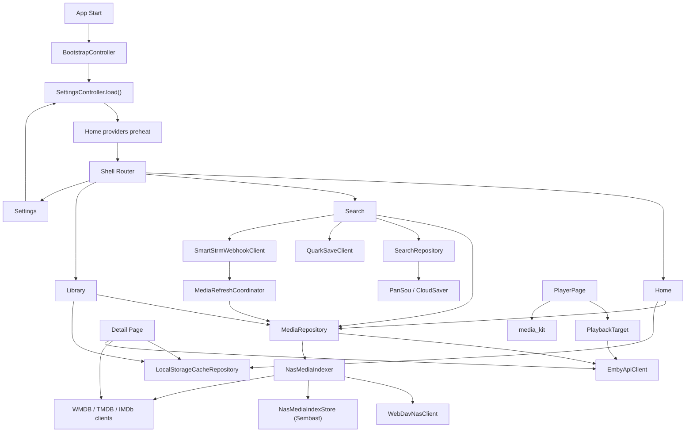

# Starflow 架构说明

这份文档描述的是仓库当前已经落地的实现，而不是早期规划稿。

Starflow 现在的核心定位不是“单一播放器”，而是一个面向个人影音库的跨平台入口，把下面几类能力收在同一套应用体验里：

- 本地媒体源：`Emby`、`WebDAV`
- 发现内容：豆瓣
- 在线搜索：`PanSou`、`CloudSaver` 等可配置来源
- 播放：应用内播放器
- 网络存储联动：夸克保存、`SmartStrm` Webhook、媒体源刷新
- 本地缓存：详情缓存、图片缓存、`WebDAV` 元数据索引

## 1. 设计原则

### 1.1 单代码库跨平台

项目基于 Flutter，统一覆盖 `iOS / Android / macOS / Windows / Linux / Web`。应用入口在 `lib/main.dart`，启动时完成：

- Flutter 绑定初始化
- `media_kit` 初始化
- `ProviderScope` 注入

### 1.2 本地优先

Starflow 当前最重要的架构选择是“本地优先”：

- 设置先落到本地
- `WebDAV` 媒体先扫描并建立本地索引
- 首页、媒体库、详情页优先读取本地缓存或索引
- 在线元数据补全作为增量 enrichment，而不是每次页面打开都从头请求

这让应用的核心链路更稳定，也避免把详情页变成一个又慢又脆的“实时刮削器”。

### 1.3 统一领域模型

不同来源的数据最终都会尽量落到统一模型上，避免页面直接依赖某个第三方协议：

- `MediaItem`
- `MediaSourceConfig`
- `MediaCollection`
- `MediaDetailTarget`
- `PlaybackTarget`
- `HomeModuleConfig`
- `SearchProviderConfig`
- `DoubanEntry`

### 1.4 页面只依赖 provider

页面层主要通过 Riverpod provider 读取状态和触发动作，不直接持有底层 HTTP 细节。这样做的好处是：

- UI 和数据源解耦
- 同一份数据可在首页、媒体库、详情页复用
- 设置变化后可以通过 invalidation 统一刷新

## 2. 代码组织

当前 `lib` 目录主要分成三层：

```text
lib/
  main.dart
  app/
    app.dart
    shell_layout.dart
    router/
    theme/
  core/
    storage/
    utils/
    widgets/
  features/
    bootstrap/
    details/
    discovery/
    home/
    library/
    metadata/
    playback/
    search/
    settings/
    storage/
```

### 2.1 `app`

应用壳层，负责全局外观和导航：

- `app.dart`：`MaterialApp.router`
- `router/app_router.dart`：`GoRouter` + `StatefulShellRoute.indexedStack`
- `theme/app_theme.dart`：全局主题
- `shell_layout.dart`：页面统一壳布局

一级导航目前是：

- 首页
- 搜索
- 媒体库
- 设置

详情页、播放器、首页编辑、分区列表、索引管理页则通过独立路由进入。

### 2.2 `core`

与具体业务弱相关的底层公共能力：

- `storage/`：图片缓存抽象、本地缓存模型
- `utils/`：网络图片头、调试 trace、种子数据等
- `widgets/`：通用 UI 组件

### 2.3 `features`

按业务能力拆分，每个 feature 内部再按 `application / data / domain / presentation` 组织。

当前最关键的模块有：

- `bootstrap`：启动页与预热流程
- `home`：首页模块装配
- `library`：媒体源接入、`WebDAV` 索引、刷新协调
- `details`：详情页、详情缓存、索引管理入口
- `metadata`：`WMDB / TMDB / IMDb` 元数据匹配
- `search`：本地搜索、在线搜索、夸克保存、`SmartStrm`
- `playback`：播放器
- `settings`：设置读写与配置模型
- `storage`：详情缓存 revision 等辅助状态

## 3. 分层方式

Starflow 当前的实现可以理解成“按功能拆分的四层结构”。

### 3.1 Presentation

负责页面、组件和交互：

- 启动页
- 首页与首页编辑
- 媒体库列表
- 详情页
- 搜索页
- 设置页
- 播放器页

这一层尽量不直接写第三方协议。

### 3.2 Application

负责拼装页面可直接消费的状态，以及跨 feature 的协调：

- `bootstrap_controller.dart`
- `home_controller.dart`
- `settings_controller.dart`
- `media_refresh_coordinator.dart`
- `webdav_scrape_progress.dart`

这一层是 Riverpod provider 最集中的地方。

### 3.3 Domain

负责稳定的业务模型和匹配规则：

- 媒体模型
- 详情模型
- 搜索模型
- 豆瓣模型
- 元数据匹配模型
- 标题匹配与识别规则

### 3.4 Data

负责：

- 本地持久化
- 第三方 HTTP 调用
- 扫描、索引、缓存写回

这里有两个历史命名需要注意：

- `features/library/data/mock_media_repository.dart`
- `features/search/data/mock_search_repository.dart`

这两个文件名虽然带 `mock`，但现在已经是应用实际在用的 facade，不是纯假实现。

## 4. 运行时总览



## 5. 启动链路

启动流程由 `BootstrapController` 驱动，逻辑比较轻，但职责很明确：

1. 启动应用壳、主题和路由
2. 读取本地设置
3. 预热首页模块
4. 进入主壳页面

这里的关键点是：

- 设置是启动阶段的第一优先级，因为后续所有能力都依赖媒体源、搜索源和首页模块配置
- 首页预热是 best-effort，不阻塞用户进入应用
- 启动页更像“温和预热”，不是重型初始化框架

## 6. 配置与状态管理

### 6.1 设置存储

设置由 `SettingsController` 管理，通过 `AppSettingsRepository` 持久化。

当前存储实现：

- `features/settings/data/app_settings_repository.dart`
- 后端：`SharedPreferences`

保存内容包括：

- 媒体源配置
- 搜索服务配置
- 豆瓣账号配置
- 网络存储配置
- 元数据匹配开关
- 首页模块配置
- 播放设置

### 6.2 配置迁移与清洗

设置加载时还做两件事：

- 迁移旧版网络存储配置到新的 `NetworkStorageConfig`
- 去掉历史 demo 数据和失效默认模块

所以 `load()` 不只是简单反序列化，也承担一部分本地数据迁移职责。

## 7. 首页架构

首页不是固定页面，而是“模块容器”。

核心组成：

- `HomeModuleConfig`：模块定义
- `homeEnabledModulesProvider`：启用模块列表
- `homeSectionProvider`：单模块装配
- `homeSectionsProvider`：首页模块聚合

当前首页模块主要分两类：

- 本地媒体模块：最近新增、指定媒体源分区
- 豆瓣模块：想看、在看、看过、推荐、片单、轮播

首页的实现特点：

- 模块配置来自设置，而不是写死
- 首页卡片统一映射到 `MediaDetailTarget`
- 首页在跳详情前会先尝试合并详情缓存

这意味着首页并不只是“展示列表”，它也是详情页缓存命中的入口之一。

## 8. 媒体库架构

媒体库通过 `MediaRepository` 统一对外，底下分成两条主要接入链路。

### 8.1 Emby 链路

`Emby` 相关能力主要通过 `EmbyApiClient` 提供：

- 登录鉴权
- 分区获取
- 媒体列表读取
- 子项读取
- 播放信息解析

`MediaRepository` 会根据媒体源配置决定：

- 是读取全部分区
- 还是只读取用户选中的分区

### 8.2 WebDAV 链路

`WebDAV` 是当前 NAS 侧的核心接入方式，但页面不会直接把 `WebDavNasClient` 当作长期数据源使用。

实际链路是：

1. `WebDavNasClient` 扫描目录
2. `NasMediaIndexer` 识别、聚合、补元数据
3. `NasMediaIndexStore` 落本地索引
4. 首页 / 媒体库 / 详情页优先读取索引

也就是说，`WebDAV` 的页面消费模型是“索引驱动”，不是“页面直扫目录驱动”。

### 8.3 为什么要有 `NasMediaIndexer`

`NasMediaIndexer` 是当前项目最关键的业务组件之一，负责把原始 `WebDAV` 文件树提升成可直接展示的媒体条目。

它处理的事情包括：

- 构建文件指纹
- 识别标题、年份、类型、季集
- 读取 `NFO / poster / fanart / logo / banner / extrafanart`
- 读取 `streamdetails`
- 识别文件名或目录名里的 `IMDb ID`
- 调用 `WMDB / TMDB / IMDb`
- 生成统一的 `MediaItem`
- 聚合剧、季、集父子关系
- 持久化索引记录

### 8.4 WebDAV 两阶段刷新

当前 `WebDAV` 刷新是两阶段的：

1. 建立索引
2. 后台补元数据

第一阶段优先把目录和基础条目建立出来，保证页面尽快可用。

第二阶段再对需要补齐的条目做 sidecar 或在线 enrichment。

### 8.5 增量刷新

`NasMediaIndexer` 通过以下信息判断是否可以复用旧索引：

- `sourceId`
- `resourcePath`
- `modifiedAt`
- `fileSizeBytes`

这些字段会组成 fingerprint。未变化的条目会直接复用旧记录；新增或指纹变化的条目才会进入后续增量处理。

### 8.6 本地索引存储

`WebDAV` 索引存储在 `NasMediaIndexStore` 中，当前实现为：

- `SembastNasMediaIndexStore`
- 后端：`Sembast`

索引里保存的不只是“文件列表”，还包括：

- 识别结果
- 元数据命中状态
- 外部 ID
- 海报与背景图
- 资源技术信息
- 最终 `MediaItem`
- 作用域 `scopeKey`

`scopeKey` 用来区分当前索引是否仍适用于当前媒体源配置，例如：

- 选中的分区是否变化
- 结构推断开关是否变化
- sidecar 开关是否变化
- 排除目录关键字是否变化

### 8.7 已选分区优先

无论是 `Emby` 还是 `WebDAV`，仓库当前都尽量只围绕“已选分区”工作：

- 媒体库只展示已选分区
- 首页模块只引用已选分区
- 本地搜索只在已选范围内搜索
- 手动资源匹配也只在已选范围里找

这让 UI、刷新、搜索三条链路的作用域保持一致。

## 9. 详情页与元数据架构

详情页的核心模型是 `MediaDetailTarget`。

它不是简单的页面 DTO，而是把下面几件事合并在一起的“详情上下文”：

- 展示数据
- 匹配查询词
- 来源信息
- 外部 ID
- 播放目标

### 9.1 详情页读取顺序

详情页会按这个顺序拿数据：

1. 先拿 seed target
2. 读取本地详情缓存
3. 合并缓存命中的缺失字段
4. 必要时自动补齐元数据
5. 对 Emby 播放目标补全真实播放信息
6. 把最终结果写回详情缓存

### 9.2 为什么 NAS 详情页默认不再在线刮削

详情页里的自动补元数据有一个重要分支：

- 对普通详情目标，可以按设置继续走 `WMDB / TMDB / IMDb`
- 对来自 `WebDAV` 且已具备 `sourceId` 的目标，默认跳过自动在线补齐

原因是 `WebDAV` 资源应当优先相信索引阶段的结果，避免详情页再次变成“实时刮削入口”。

### 9.3 手动索引管理

`WebDAV` 详情页额外提供索引管理入口，用于：

- 修改搜索词
- 修改年份
- 切换是否按剧集匹配
- 手动搜索 `WMDB / TMDB / IMDb`
- 把结果直接写回本地索引和详情缓存

因此这里改的是“长期可复用的数据”，不是当前页面的一次性临时状态。

## 10. 元数据匹配策略

元数据模块由 `metadata/` 负责，当前主要分三类客户端：

- `WmdbMetadataClient`
- `TmdbMetadataClient`
- `ImdbRatingClient`

### 10.1 职责划分

- `WMDB`：中文标题、简介、豆瓣评分、豆瓣与 IMDb ID
- `TMDB`：海报、简介、导演、演员、类型、时长
- `IMDb`：评分补充

### 10.2 优先级

自动匹配会受设置控制：

- 开关是否启用
- `TMDB` token 是否配置
- `WMDB / TMDB` 的优先级设置

### 10.3 本地信息优先

无论是索引期还是详情期，整体策略都偏向：

1. 本地 sidecar
2. 文件名和目录名里的外部 ID
3. 在线匹配补缺

已有的本地标题、简介、海报并不会轻易被在线结果强制覆盖。

## 11. 搜索架构

搜索页当前没有单独的 controller，而是由页面状态机直接协调搜索任务。

### 11.1 搜索目标

搜索页会动态组合三类目标：

- 全部
- 本地媒体源
- 在线搜索服务

### 11.2 并发模型

一次搜索会拆成多个 operation：

- 本地源搜索调用 `searchLocal`
- 在线源搜索调用 `searchOnline`

这些 operation 会并发启动，结果谁先回来谁先渲染。

### 11.3 本地搜索

本地搜索不是额外索引库，而是直接基于 `MediaRepository.fetchLibrary()` 的结果做评分匹配：

- 标题精确匹配
- 标题包含
- 分词命中
- 简介兜底

### 11.4 在线搜索

在线搜索通过 `SearchRepository` 对外统一，底层目前支持：

- `PanSouApiClient`
- `CloudSaverApiClient`

搜索结果还会套一层 provider 级过滤：

- 强匹配
- 过滤词
- 网盘类型过滤
- 标题长度限制
- 相同资源 URL 去重

## 12. 网络存储联动

搜索结果可以继续进入“保存到夸克 -> 触发 SmartStrm -> 刷新媒体源”的链路。

### 12.1 夸克保存

`QuarkSaveClient` 负责：

- 解析分享链接
- 拉取分享 token
- 枚举分享内容
- 确保目标目录存在
- 发起保存

### 12.2 SmartStrm 触发

`SmartStrmWebhookClient` 负责：

- 触发 Webhook
- 记录成功或失败日志
- 解析新增条目数等返回信息

### 12.3 媒体源刷新

如果网络存储配置里指定了需要刷新的媒体源，搜索页会调用 `MediaRefreshCoordinator`：

- 支持延迟刷新
- 支持同时刷新多个媒体源
- 刷新后统一 invalidate 首页相关 provider

这条链路把“搜索保存成功”真正接回了“首页和媒体库内容更新”。

## 13. 播放架构

播放器页基于 `media_kit`。

核心流程：

1. 进入播放器页
2. 检查 `PlaybackTarget`
3. 如果是 Emby 且仍需解析，则先补全真实播放信息
4. 探测启动测速
5. 调用 `player.open`
6. 失败时自动重试，最多 3 次
7. 超过设置的最大打开超时时间则终止

播放器页当前还额外做了轻量启动探针，用于展示：

- 估算网速
- 分辨率
- 格式
- 码率

## 14. 本地缓存与持久化

Starflow 当前至少有三类本地持久化数据，它们的职责不同。

### 14.1 设置缓存

- 存储：`SharedPreferences`
- 内容：应用配置

### 14.2 详情缓存

- 存储：`SharedPreferences`
- 仓库：`LocalStorageCacheRepository`
- 内容：`MediaDetailTarget`

详情缓存使用多组 lookup key 命中：

- `library|sourceId|itemId`
- `douban|doubanId`
- `imdb|imdbId`
- 标准化标题
- 标准化查询词

### 14.3 WebDAV 索引库

- 存储：`Sembast`
- 仓库：`NasMediaIndexStore`
- 内容：`NasMediaIndexRecord`

### 14.4 图片缓存

图片缓存通过 `persistent_image_cache` 抽象层统一访问：

- IO 平台走本地持久化实现
- 非 IO 平台走 stub 或对应实现

它和详情缓存、索引库是分开的，不共享数据模型。

## 15. 核心模型关系

可以把最关键的模型关系理解成这样：

- `MediaSourceConfig`：定义“从哪里拿媒体”
- `MediaCollection`：定义“这个来源下有哪些分区”
- `MediaItem`：统一的媒体卡片与播放基础模型
- `MediaDetailTarget`：详情页上下文
- `PlaybackTarget`：播放器上下文
- `SearchResult`：搜索展示模型
- `NasMediaIndexRecord`：`WebDAV` 资源的长期索引记录

其中：

- `MediaItem` 是列表层主模型
- `MediaDetailTarget` 是详情层主模型
- `PlaybackTarget` 是播放层主模型

## 16. 当前架构的几个关键判断

### 16.1 `WebDAV` 不再是页面实时直扫

现在 `WebDAV` 的正确理解方式是：

- `WebDavNasClient` 负责扫描
- `NasMediaIndexer` 负责把扫描结果转成可复用索引
- 页面主要读取索引而不是直接读目录

### 16.2 详情页不是唯一的元数据入口

元数据补全现在主要发生在两处：

- `WebDAV` 索引阶段
- 非 NAS 详情页自动补齐阶段

详情页已经不是所有元数据请求的唯一入口。

### 16.3 搜索不是孤立功能

搜索的终点不只是“给用户一个链接”，它还能继续串到：

- 夸克保存
- `SmartStrm`
- 媒体源刷新
- 首页与媒体库更新

这使得搜索成为资源入库链路的一部分。

## 17. 后续扩展点

当前架构已经为下面这些方向留出了空间：

- 增加更多媒体源类型
- 增加更多在线搜索 provider
- 继续丰富首页模块
- 给播放器接入更多控制能力
- 为 `WebDAV` 索引增加查看、清理、诊断能力
- 将部分搜索或刮削能力迁移到桥接服务

如果后续继续演进，建议优先保持下面两条不变：

- 页面继续消费统一模型，不直接绑死第三方协议
- `WebDAV` 继续坚持“索引优先、页面读取缓存”的方向
